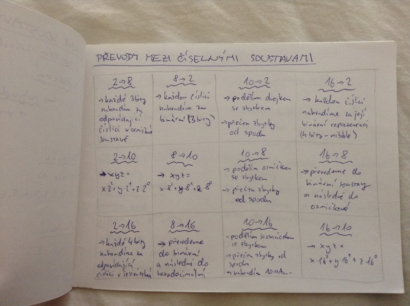
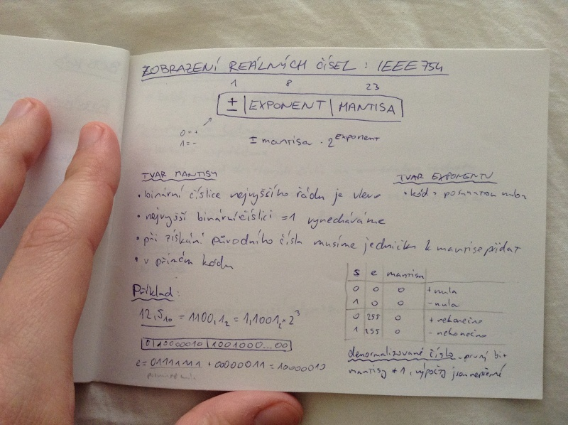

# Základní principy počítačů I.
- číselné soustavy
- vztahy mezi číselnými soustavami
- zobrazení čísel v počítači
- principy prováděných aritmetických operací

## Číselné soustavy
- nepoziční - římské číslice, jedničková soustava
- poziční
    - polyadická A=a_n · 2^n + ... + a_0 · 2^0
    - pro záporná čísla pokračujeme s exponenty do záporu

### Desítková
- báze 10
- 0, 1, 2, 3, 4, 5, 6, 7, 8, 9

### Dvojková (binární)
- báze 2
- 0, 1

### Osmičková
- báze 8
- 0, 1, 2, 3, 4, 5, 6, 7

### Šestnáctková (hexadecimální)
- báze 16
- 0, 1, 2, 3, 4, 5, 6, 7, 8, 9, A, B, C, D, E, F

## Převody mezi číselnými soustavami

## Zobrazení čísel v počítači

### Bez znaménka
- <0; 2^n - 1>
- pouze kladná čísla

### Přímý kód
- <-(2^(n-1) - 1); 2^(n-1) - 1>
- dvě nuly
- špatné přetečení
- znaménkový bit

### Inverzní kód
- <-(2^(n-1) - 1; 2^(n-1) - 1)>
- dvě nuly
- zápor je inverze
- intuitivnější přetečení

### Dvojkový doplňkový kód
- <-2^(n-1); 2^(n-1) - 1>
- inverzní kód + přičtení 1
- nemá dvě nuly
- intuitivní přetečení

Při sčítání se přenosy se znaménkového bitu ignorují.

Přetečení nastává, pokud se nerovná přenos ze znaménkového bitu do znaménkového bitu.

U sčítání v inverzním kódu provádíme kruhový přenos - přenos + nejvyšší řád přičteme k výsledku.

## BCD kód

- rozvinutý tvar
    - 71346_10 = F7F1F3F4C6_16
    - -71346_10 = F7F1F3F4D6_16
- zhuštěný tvar
    - 71346_10 = 7134C6_16
    - -71346_10 = 7134D6_16

## Zobrazení reálných čísel : IEEE754

+- (1 bit) | exponent (8 bitů) | mantisa (23 bitů) -> +- mantisa · 2^exponent

### Tvar mantisy
- binární číslice nevyššího řádu je vlevo
- nejvyšší binární číslici = 1 vynecháváme
- při získání původního čísla musíme jedničku k mantise přidat
- v přímém kódu

### Tvar exponentu
- kód s posunutou nulou

Příklad:

## Vnější kódy
- každý znak má numerickou hodnotu

### Jednobajtová kódování
- lexikálně uspořádané
- snadný převod desítkových číslic na numerickou hodnotu

- ASCII - 7bitové
- Windows-1250, ISO8859-2 - 8bitové

### Vícebajtová kódování
- UNICODE
- UTF-8 = nejpoužívanější zobrazení UNICODE znaků

## Little-endiand vs. big-endian
číslo 4A 3B 2C 1D_16

### Little-endian
= bajt nejnižšího řádu je uložen na nejnižší adrese

Intelx86

1D 2C 3B 4A

### Big-endiand
= bajt nejvyššího řádu je uložen na nejnižší adrese

4A 3B 2C 1D

## Principy provádění aritmetických operací

### Proces sčítání reálných čísel v IEEE:
1. denormalizujeem - doplníme jedničku k mantise
2. srovnáme exponenty
3. sečteme
4. zpátky normalizujeme - opět odebereme jedna od mantisy