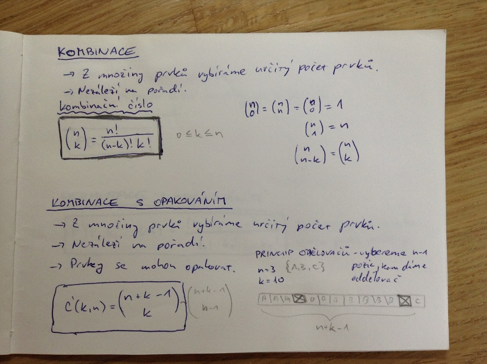
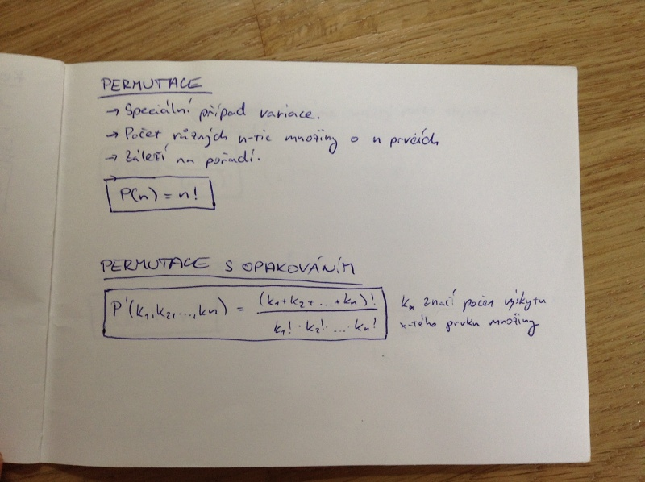
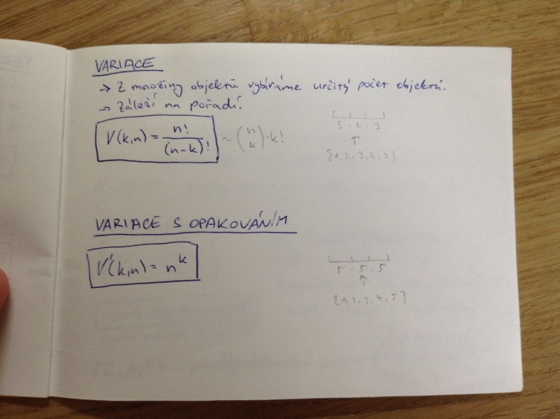
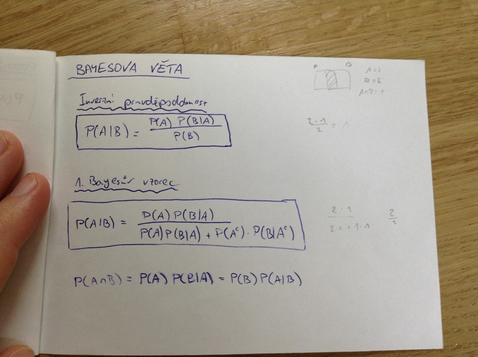

# Kombinatorika a pravděpodobnost
- elementární kombinatorika
    - kombinace
    - permutace
    - variace
- řešení jednoduchých kombinatorických úloh
- pravděpodobnost
- podmíněná pravděpodobnost
    - Bayesova věta

## Kombinace
- Z množiny prvků vybíráme určitý počet prvků.
- Nezáleží na pořadí.

## Kombinace s opakováním
- Z množiny prvků vybíráme určitý počet prvků.
- Nezáleží na pořadí.
- Prvky se mohou opakovat.

Princip oddělovačů - pro výběr k prvků z n kategorií vybereme n-1 pozic, na které dáme oddělovač.

Vzorečky na kombinační číslo a na řešení kombinací s opakováním na obrázku:

## Permutace
- Speciální případ variace.
- Počet různýc n-tic množiny o n prvcích.
- Záleží na pořadí.

P(n) = n!

## Permutace s opakováním
Vzoreček na obrázku:

## Variace
- Z množiny objektů vybírám určitý počet objektů.
- Záleží na pořadí.

Vzoreček pro variace i variace s opakováním na obrázku:

## Pravděpodobnost
\Omega ... _základní prostor_ = konečná množina možných jevů (např {1, 2, 3, 4, 5, 6} pro možné hody kostkou)
\omega_k ... _možný výsledek_ - \omega_k \in \Omega, např. 2
A \subset \Omega ... _náhodný jev_ - např. padne sudá číslo {2, 4, 6}
A^c = \Omega \diff A ... _opačný jev_ - např. padne liché číslo {1, 3, 5}

_pravděpodobnost_
P(A) = |A| \ |\Omega|

P(A \cup B) = P(A) + P(B) - P(A \cap B) (princip inkluze a exkluze)

_podmínky pravděpodobnosti_
- \Omega je konečná množina
- nemůže nastat \omega_n a \omega_m zároveň (pokud n \neq m)
- každý jednotlivý výsledek je stejně možný

(\Omega, A, P) ... pravděpodobnostní prostor
- P je nezáporná
- P je aditivní (P(A \cup B) = P(A) + P(B), pokud A \cap B = \emptyset)
- P(\Omega) = 1

## Podmíněná pravděpodobnost
P(A|B) = P(A \cap B) / P(B) = pravděpodobnost jevu A, pokud nastal jev B (P(B) > 0)

dva jevy jsou stochasticky nezávislé, pokud pro ně platí:

P(A \cup B) = P(A) \cdot P(B)

## Bayesova věta
Vzorečky na obrázku:

