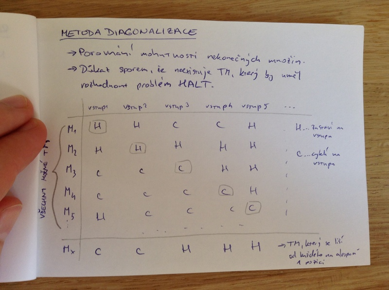

# Vyčíslitelnost
- Turingův stroj
- problém zastavení
- rozhodnutelnost
- částečná rozhodnutelnost
- nerozhodnutelnost
- metoda redukce
- metoda diagonalizace

## Turingův stroj (deterministický)

M = (Q, \Sigma, \Gamma, \tri, \space, \delta, q_0, q_acc, q_rej)

Q ... konečná množina stavů

\Sigma ... konečná vstupní abeceda

\Gamma ... konečná pracovní abeceda, \Sigma \subset \Gamma

\tri \in \Gamma \minus \Sigma ... levá koncová značka

\space \in \Gamma \minus \Sigma ... znakča prázdného políčka

\delta : (Q \minus {q_acc, q_rej}) \times \Gamma -> Q \times \Gamma \times {L, R} ... totální přechodová funkce

q_0 \in Q ... počáteční stav

q_acc \in Q ... akceptující stav

q_rej \in Q ... zamítající stav

Pro každé q \in Q existuje p \in Q takový, že \delta(q, \tri) = (p, \tri, R). (\tri nelze přepsat, nelze se posunout za levý okraj pásky)

## Turingův stroj II.

_Konfigurace_ Turingova stroje

(q, z, n) \in Q \times {y\space^\omega | y \in \Gamma*} \times \Nat_0

_počáteční konfigurace_ pro vstup w \in \Sigma* je (q_0, \triw\space^\omega, 0)

_akceptující konfigurace_ je každá trojice tvaru (q_acc, z, n)

_zamítající konfigurace_ je každá trojice tvar (q_rej, z, n)

Vícepáskový i nedeterministický TV jsou ekvivalentní deterministickému TM.

_Úplný TM_ se vstupní abecedou \Sigma má všechny výpočty konečné (rozhoduje rekurzivní jazyky).

## Výpočet Turingova stroje

_krok výpočtu_

(p, z, n) \leftt_M (q, s_b^n(z), n + 1) pro \delta(p, z_n) = (q, b, R) a (q, s_b^n(z), n - 1) pro \delta(p, z_n) = (q, b, L)

_výpočet_ TM M na vstupu w je maximální posloupnost konfigurací k_0, k_1, ... kde k_0 je počáteční konfigurace pro w a k_i \leftt_M k_i+1 pro i \geq 0.

Stroj M _akceptuje_ slovo w právě, když je výpočet M na w konečný a jeho poslední konfigurace je akceptující.

Stroj M _zamítá_ slovo w právě, když je výpočet M na w konečný a jeho poslední konfigurace je zamítající.

Stroj M _cyklí_ pro vstup w právě, když je výpočet M na w nekonečný.

_Jazyk akceptovaný_ M: L(M) = {w \in \Sigma* | M akceptuje w}

## Problém zastavení (HALT)
= problém rozhodnout, zda daný TM M má na daném slově w nad jeho vstupní abecedou konečný výpočet.

HALT = {<M,w> | M je TM a výpočet M na w je konečný}

Problém zastavení je _částečně rozhodnutelný_:
- pomocí univerzálního TM simulujeme M na w. Pokud simulovaný výpočet skončí, akceptujeme.

Problém zasatavní je _nerozhodnutelný_:
- Důkaz sporem pomocí problému akceptování (místo zamítajících stavů začne cyklit).

## Rozhodnutelnost

### Rozhodnutelný problém
- právě když L je rekurzivní
- také jeho doplněk je rozhodnutelný
- existuje úplný TM, který ho akceptuje (existuje TM, který ho rozhoduje)

### Nerozhodnutelný problém
- právě když L není rekurzivní

### Částečně rozhodnutelný (semirozhodnutelný problém)
- právě když L je rekurzivně spočetný
- jeho doplněk není rozhodnutelný
- existuje TM, který ho akceptuje
- např. ACC, HALT

## Vyčíslitelnost
Funkce f : \Sigma* -> \Phi* je _vyčíslitelná_, pokud existuje TM M, který na vstupu w zastaví, právě když f(w) je definovaný a navíc f(w) = M(w).

Funkce je _totálně vyčíslitelná_, pokud je vyčíslitelná a totální. 

## Metoda redukce
Nechť A \subset \Sigma* a B \subset \Phi* jsou jazyky. Řekněme, že A se _m-redukuje_ na B, píšeme A \leq_m B, právě když existuje totálě vyčíslitelná funkce f : \Sigma* -> \Phi* taková, že w \in A \equiv f(w) \in B.

Funkci f nazveme _redukcí_ A na B.

A a B jsou _m-ekvivalentní_, píseme A \congruent_m B, pokud A \leq_m B a B \leq_m A.

## Redukce a rozhodnutelnost

Nechť A \leq_m B:
- B je rekurzivní \implies A je rekurzivní
- B je rekurzivně spočetný => A je rekurzivně spočetný
- A není rekurzivní => B není rekurzivní
- A není rekurzivně spočetný => B není rekurzivně spočetný

Nechť A \congruent_m B:
- A je rekurzivní \equiv B je rekurzivní
- A je rekurzivně spočetný \equiv B je rekurzivně spočetný

## Metoda diagonalizace
- Porovnání mohutnosti nekonečných množin.
- Důkaz sporem, že neexistuje TM, který by uměl rozhodnout HALT.

Obrázek:

