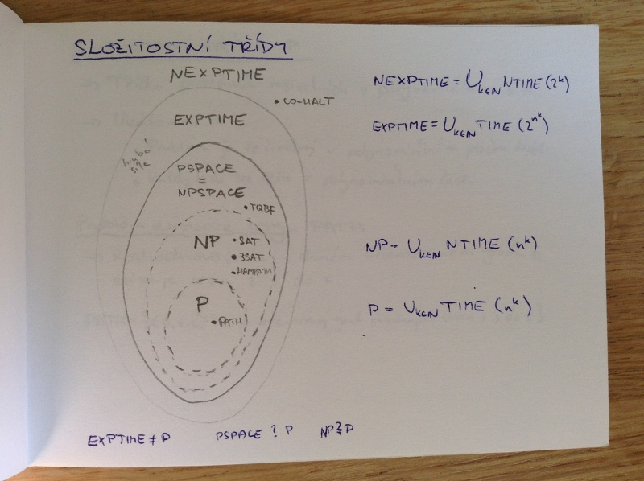

# Složitost
- složitost algoritmu vs. složitost problému
- složitnostní třídy a vztahy mezi nimi
    - P
    - NP
    - PSPACE
- příklady problémů z jednotlivých tříd
- těžkost a úplnost problému v dané třídě
- polynomiální redukce problémů
- NP-úplné úlohy

## Časové složitostní třídy problémů
_časová složitost problému_ = nejmenší časová složitost, s jakou lze daný problém rozhodnout (nejlepší algoritmus)

### Deterministická časová složitostní třída problémů

f: ℕ -> ℝ+

TIME(f(n)) = {L|L je rozhodovaný nějakým deterministickým jedno- nebo vícepáskovým TM M s časovou složitostí T_M(n) = o(f(n))}

### Nedeterministická časová složitostní třída problémů

NTIME(f(n)) = {L|L je rozhodovaný nějakým nedeterministickým jedno- nebo vícepáskovým TM M s časovou složitostí T_M(n) = o(f(n))}

TIME(f(n)) ⊂ NTIME(f(n))

Deterministický TM lze převést na ekvivalentní nedeterministický TM, který bude pracovat v čase O(f^2(n)), pokud původní byl v čase O(f(n))

## Složitostní třídy

## Složitostní třída P
- třída problémů řešitelných v polynomiálním čase.
- Ukážeme, že:
    - problém je řešitelný v polynomiálním počtu kroků.
    - každý krok lze řešit v polynomiálním čase.

### Problém existence cesty PATH
- Rozhodnout, zda v daném orientovaném grafu G existuje cesta z s do t.

PATH = {<G,s,t>|G je orientovaný graf obsahující cestu z s do t}

## Složitostní třída NP
- Třída problémů, které řeší nedeterministický TM v polynomiálním čase. (Jsme chopní ověřit řešení v polynomiálním čase).

### Problém Hamiltonovské cesty HAMPATH
- Rozhodnout, zda v daném orientovaném grafu G existuje Hamiltonovská cesta z s do t (každým uzlem projde právě jednou).

HAMPATH = {<G,s,t> | G je orientovaný graf obsahující Hamiltonovskou cestu z s do t}

### Problém splnitelnosti SAT
- Rozhodnout, jestli je daná formule ve výrokové logice splnitelná.

SAT = {<φ> | φ je splnitelná booleovská formule}

3SAT

## Složitostní třída PSPACE
- Třída problémů, které řeší Turingův stroj s využitím polynomiálního množství prostoru.

### Problém TQBF (Totally Qualified Boolean Formula)
- Rozhodnout, zda je daná kvantifikovaná formule ve výrokové logice ve výrokové logice bez volných proměnných pravdivá (True).

TBQF = {<φ> | φ je pravdivá QBF formule bez volných proměnných}

TBQF ∈ PSPACE ∧ TQBF je PSPACE těžký ⇒ TQBF je PSPACE úplný.

## Těžkost a úplnost problému v dané třídě

Nechť C je složitostní třída splňující P ⊂ C.

Jazyk L je _těžký_ ve třídě C (C-těžký), právě když pro každý jazyk L' ∈ C platí L' ≤_p L.

Jazyk L je _úplný_ ve třídě C (C-úplný), pokud je C-těžký a zároveň L ∈ C.

## Polynomiální redukce

Nechť A ⊂ Σ* a B ⊂ Φ* jsou jazyky. Řekněme, že A se polynomiálně redukuje na B, píšeme A ≤_p B, právě když A ≤_m B a redukční funkce je vyčíslitelná Turingovým strojem pracujícím v polynomiálním čase. Funkci f nazveme redukcí A na B v polynomiálním čase.

Nechť A ≤_P B:
- B ∈ P ⇒ A ∈ P
- B ∈ NP ⇒ A ∈ NP
- A ∉ P ⇒ B ∉ P
- A ∉ NP ⇒ B ∉ NP

## NP-úplné úlohy
_problém obchodního cestujícího_ = nalezení nejkratší hamiltnonovské kružnice v grafu

_problém splnitelnosti_ = splnitelnost formule v konjunktivní normální formě

_problém batohu_ = kombinace zboží s největší cenou do omezeného váhového (objemového) limitu

_problém isomorfního grafu_ = existence podgrafu grafu H, isomorfního ke grafu G

_problém k-kliky_ = existence úplného podgrafu s k vrcholy

_obarvitelnost grafu třemi barvami_
