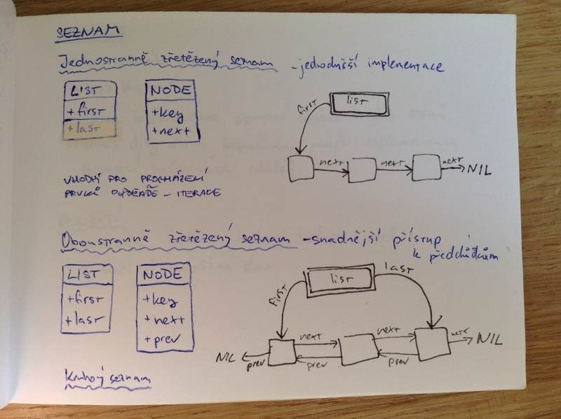
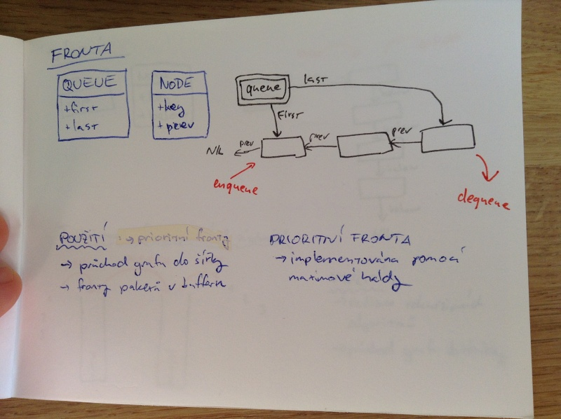
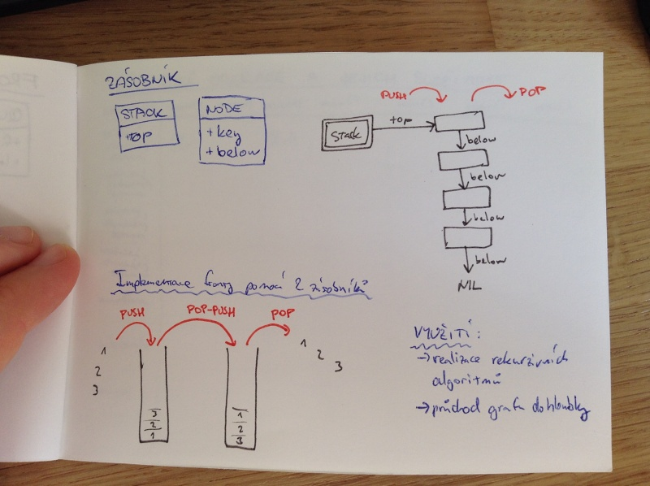

# Základní datové struktury
- základní datové struktury
    - seznam
    - množina
    - zásobník
    - fronta
- související operace a jejich složitost
- typické implementace
- příklady použití

## Datové struktury
_jednoduchý datový typ_ = data zabírají konstantní (malé) množství paměti a jejich zpřístupnění trvá konstantní čas (int, bool, float, ...)

_složený datový typ_
- _statický_ 
    - pevná velikost, zpřístupnění v konstantním čase
    - n-tíce, pole konstatní délky
- _dynamický_
    - neomezená velikost
    - doba zpřístupnení je závislá na velikosti
    - seznam, zásobník, fronta, slovní, seznam, graf

_datová strukutra_ = implementace složeného datového typu

## Seznam

## Množina
- bez určeného pořadí
- bez duplicit
- dříve implementace pomocí červeno-černých stromů
- dnes díky větším kapacitám paměti implementace pomocí hašovacích tabulek

_Použití_
- testování, jestli se zadaná hodnota nachází v určité množině dat

## Fronta

## Zásobník

## Základní operace a jejich složitost

| Struktura                   | insert | remove | search | max | min | next | prev |
| seřazený jednosměrný seznam | o(n)  |        | o(n)  |
| neseřazený jednosměrný seznam |
| seřazený obousměrný seznam |
| neseřazený obousměrný seznam |
| množina |
| zásobník |
| fronta |