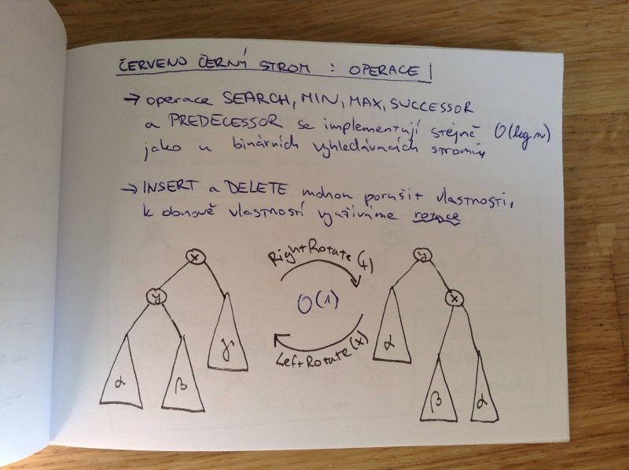
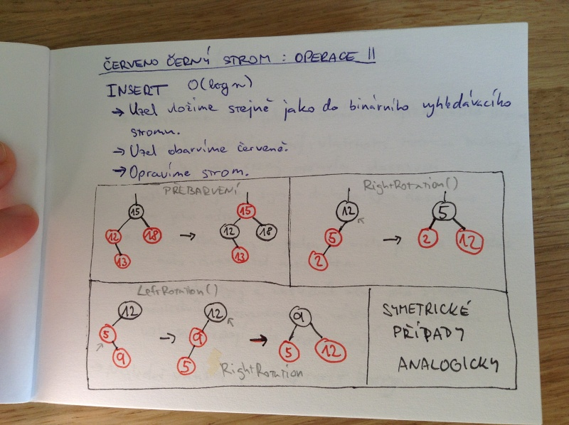

# Datové struktury založené na stromech
- stromové datové struktury
    - binární vyhledávací stromy
    - B-stromy
    - červeno-černé stromy
    - haldy
- související operace a jejich složitost
- typické implementace
- příklady použití

## Binární vyhledávací strom
= binární strom, ve kterém platí, že klíč každého uzlu je větší nebo roven než všechny klíče v jeho levém podstromě a menší nebo roven všem klíčům v jeho pravém podstromě

Průchody -> Θ(n)

_inorder_: x.left, x, x.right

_preorder_: x, x.left, x.right

_postorder_: x.left, x.right, x

x.left, x.right je rekurzivní zavolání fce na pravý/levý podstrom

## Binární vyhledávací strom: implementace
- každý vrchol představuje jeden objekt
- vrchol má _hodnotu_ a ukazatel na svého _levého_ a _pravého_ syna

_následník_ uzlu je uzel obsahující nejmenší klíč větší než x.key

_předchůdce_ uzlu x je uzel obsahující největší klíč menší než x.key

### Binární vyhledávací strom: využití
- teoretický základ pro další odvozené struktury
- např. intervalové stromy

## Binární vyhledávací strom: operace

### Vyhledávání Θ(n)
- Rekurzivně postupujeme od kořene a porovnáváme velikost klíče, podle toho se vydáme doprava/doleva.

### Minimální/maximální klíč Θ(n)
- Postupujeme doleva/doprava, dokud nenarazíme na list.

### Následník uzlu Θ(n)
- Pokud má uzel neprázdný pravý podstrom, je následník minimální prvek tohoto podstromu.
- Pokud uzel nemá pravý podstrom, procházíme jeho předky, dokud nenarazíme na první uzel do jehož levého podstromu patří náš původní uzel.

### Přidání nového uzlu Θ(n)
- Stejné jako vyhledávání, ale hledáme prázdný podstrom, kam můžeme přidat nový uzel.

### Odstranění uzlu Θ(n)
- Pokud uzel nemá syna, odstraníme ho.
- Pokud má uzel právě jednoho syna, stane se tento syn novým potomkem rodičem původního uzlu.
- Pokud má uzel dva syny, najdeme následníka (nebo předchůdce) tohoto uzlu a nahradíme ho za původní uzel, viz dále. A levého potomka předáme následníkovi.

### Přesun podstromů
- Nahradí podstrom za jiný podstrom.
- Pokud je původní podstrom kořen stromu musíme aktualizovat i tuto informaci.
- Jinak přesměrujeme ukazatel na rodiče a rodičovi aktualizujeme pravý/levý ukazatel na potomka (podle toho, kde byl ten původní).

## Halda a binární halda
= stromová datová struktura splňující vlastnosti haldy, tj. klíč každého uzlu je větší než klíč jeho potmoků, kořen má největší hodnotu

_binární halda_ = úplný binární strom s vlastností haldy

Binární strom je _úplný_, pokud jsou jeho hladiny kromě poslední úplně zaplněny a v poslední hladině leží listy co nejvíce vlevo.

_maximová halda_ = kořen je maximální prvek

_minimová halda_ = kořen je minimální prvek

## Binární halda: implementace
- Binární haldu lze reprezentovat _polem_. Levý syn uzlu k je uložen na pozici 2k. Pravý syn uzlu k je uložen na pozici 2k + 1. Otec uzlu k se nachází na pozici floor(k/2) (při indexování od 1).

### Binární halda: využití
- heapsort
- prioritní fronta ⇒ Dijkstra, Jarníkův algoritmus
- hladové algoritmy

## Binární halda: operace

### Vybudování haldy O(n)
- Upraví vstupní haldu tak, aby splňovala vlastnosti haldy (maximové).
- Přesouvá prvky směrem dolů.
- Pro každý uzel voláme odspodu metodu HEAPIFY, která opraví vstupní uzel a svoje potomky.

### Heapsort O(n log(n))
- Vybudujeme haldu a pak z ní postupně vždy odstraníme největší prvek (přidáme ho do seřazené posloupnosti) a opravíme haldu.

### Nalezení maxima O(1)
- Vrátíme kořen strom.

### Odstranění maxima O(log n)
- Pokud pole není prázdné, nahradí meximální prvek posledním prvkem, sníží velikost haldy a zavolá metodu HEAPIFY.

### Increase_key O(log n)
- Navýší hodnotu vybraného prvku, a pak směrem nahoru opraví vlastnosti haldy (porovnává s rodičem).

### Insert O(log n)
- Na konec haldy vložíme prvek s hodnotou -∞. Potom pomocí metody INCREASE_KEY navýšíme jeho hodnotu.

## Červeno-černý strom
= binární vyhledávací strom, který má uzly obarvené černo nebo červenou barvou a splňujeme následující podmínky:

- kořen stromu je černý
- listy jsou označené NIL a jsou černé
- pokud je uzel červený, je jeho otec černý
- pro každý uzel platí, že všechny cesty z tohoto uzlu do listu obsahují stejný počet černých uzlů.

_výšla uzlu_ je rovna počtu hran na nejdelší hraně z tohoto uzlu do listu.

_černá výška uzlu_ = počet černých uzlů na cestě z uzlu do listu (bez daného uzlu)

## Červeno-černý strom: implementace
- Implementujeme obdobně jako binární vyhledávací strom. Každý uzel obsahuje _hodnotu_, _barvu_ a ukazatel na _levého_ a _pravého_ potomka a _rodiče_.

Každý uzel výšky h má černou výsku alespoň h/2. Červeno-černý strom s n vnitřními uzly má výšku nejvýše 2 log_2 (n+1).

### Červeno-černý strom: využití
- pořadí (rank) prvku
- AVL stromy
- funkcionální programování (asociativní pole a množiny)

## Červeno-černý strom: operace
- operace SEARCH, MIN, MAX, SUCCESOR a PREDECESSOR se implementují stejně O(log n) jako u binárních vyhledávacích stromů.
- INSERT a DELETE mohou porušit vlastnosti, k obnově vlastností využíváme _rotace_.

### INSERT O(log n)
- Uzel vložíme stejně jako do binárního vyhledávacího strom.
- Uzel obarvíme červeně.
- Opravíme strom.

### DELETE
- Odstraníme uzel jako u binárního vyhledávacího stromu.
- Pokud byl uzel červený, vlastnosti zůstanou zachovány.
- Pokud byl uzel černý, opravím vlastnosti:
    - uzlu chybí jeden syn - druhého syna dosadíme na jeho místo.
    - uzel má dva syny a jeden z nich je jeho následník - nahradíme uzel následníkem.
    - uzel má dva syny a následník není jeho synem - následníka přesuneme na místo uzlu ostatní uzly se přepojí, ale nepřesouvají.
- Následně musíme ještě opravit barvy.

## B-strom
= zobecnění binárních vyhledávacích stromů, každý uzel obsahuje t - 1 klíčů a má t následníků, klíče vymezují t intervalů, do kterých patrí následníci, všechny listy mají stejnou hloubku

_minimální stupeň stromu t_ - každý uzel (kromě kořene) musí obsahovat alespoň t - 1 klíčů a nejvýše 2t - 1 klíčů  (kořen má alespoň jeden klíč)

_plný uzel_ = obsahuje alespoň 2t následníků

B-strom s n ≥ 1 klíči a minimálním stupněm t ≥ 2 má _hloubku_ nejvýše h ≤ log_t ((N+1)/2)

## B-strom: implementace
- Uzel má atribudy: _počet vložených klíčů_, _klíče_ v neklesajícím pořadí, informaci o tom, jestli je _list_, nebo není.
- Vnitřní uzel obsahuje navíc ukazatele na uzly.
- Všechny listy mají stejnou hloubku.

### B-strom: využití
- databáze (minimalizace přístupu na disk)
- B+ stromy

## B-strom: operace

### Vyhledávání O(t log_t n)
- Analogicky jako v binárním vyhledávacím stromě. Při výběru potomka využíváme intervaly.

### Vytvoření prázdného stromu O(1)

### Přidání klíče O(t log_t n)
- Klíč vložíme do exisujícího listu.
- Pokud přeplníme list, rozdělíme ho na dva.
- Pokud přeplníme počet potomků rodiče, rozdělíme i rodiče.
- Optimalizace počtu přístupů na disk: při průchodu preventivně rozdělujeme plné uzly.

### Odstranění klíče O(t log_t n)
- Mazání klíče probíhá vždy v listu, takže nejdříve nahradíme klíč, který není v listu, za jeho následníka, přesuneme ho do listu a až pak ho smažeme.
- Optimalizace: při průchodu zvětšujeme počet klíčů v uzlech na t.

### B+ stromy
- klíče pouze v listech
- listy jsou zřetězený
- vnitřní uzly indexují listy

